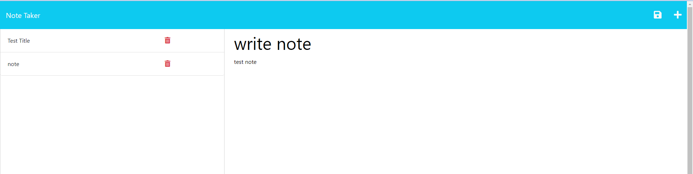

# Note Taker Application

## Description

This notetaker application can be used to write and save notes.

## Installation

App uses starter code from https://github.com/coding-boot-camp/miniature-eureka for front-end functionality and uses the uuid package for backend functionality.

## Usage
- User is presented with a landing page with a link to the notes page.
- User can enter a new note title and the note's text in the right hand column, and view an existing notes list on the left hand column. 
- User can save the note by clicking on the save icon.

 The page will resemble this image:

 

## License
N/A
## Link to github repository:
https://github.com/AnaCampos171/notetaker

## Link to deployed application: 
https://salty-inlet-01390.herokuapp.com/
